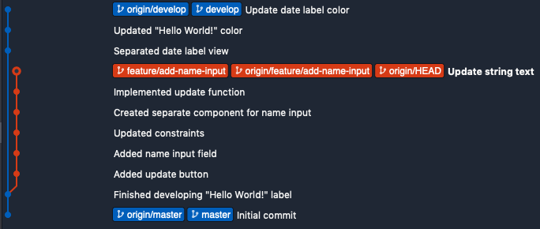

- [ ] This repo is meant to help you get a better understanding of how to do some more advanced Git commands

  ## Learning Objectives

  - [ ] Squash all commits from the `feature/add-name-input` branch to one commit with message **"Finished implementing name input field"**

  - [ ] Rebase `feature/add-name-input` onto `develop`

    - [ ] Abort rebase

  - [ ] Resolve file conflicts

  - [ ] Reset --hard `feature/add-name-input` to `origin/feature/add-name-input`

    

  ## Final deliverable

  - [ ] Project should be able to build and run
  - [ ] Commits messages should be in the following order (ascending)
    - Initial commit
    - Finished adding date label
    - Updated "Hello World!" Color
    - Update date label color
    - Finished implementing name input field
  - [ ] Latest commit should be a merge fast forward (not a merge commit)
  - [ ] "Hi There World!" text is highlighted in blue
  - [ ] Date text is highlighted in green
  - [ ] All fields are located at the top of the screen
  - [ ] `DateLabelView.swift` and `NameInputView.swift` should be present
  - [ ] Tapping the "Update" button should update the "Hi There World!" label with the user's name input (e.g. "Hi There Bob!")

  

  ## Screenshots

  **Screen - Develop**

  What the screen currently looks like on the `develop` branch

  

  **Screen - Feature**

  What the screen currenty looks like on `feature/add-name-input` branch

  

  **Screen - Final Output**

  What the screen should look like after merging the feature in to develop

  

  **Sourcetree - Before**

  What the branches look like before integration

  

  

  **Sourcetree - After**

  What the branches should look like after integration

  